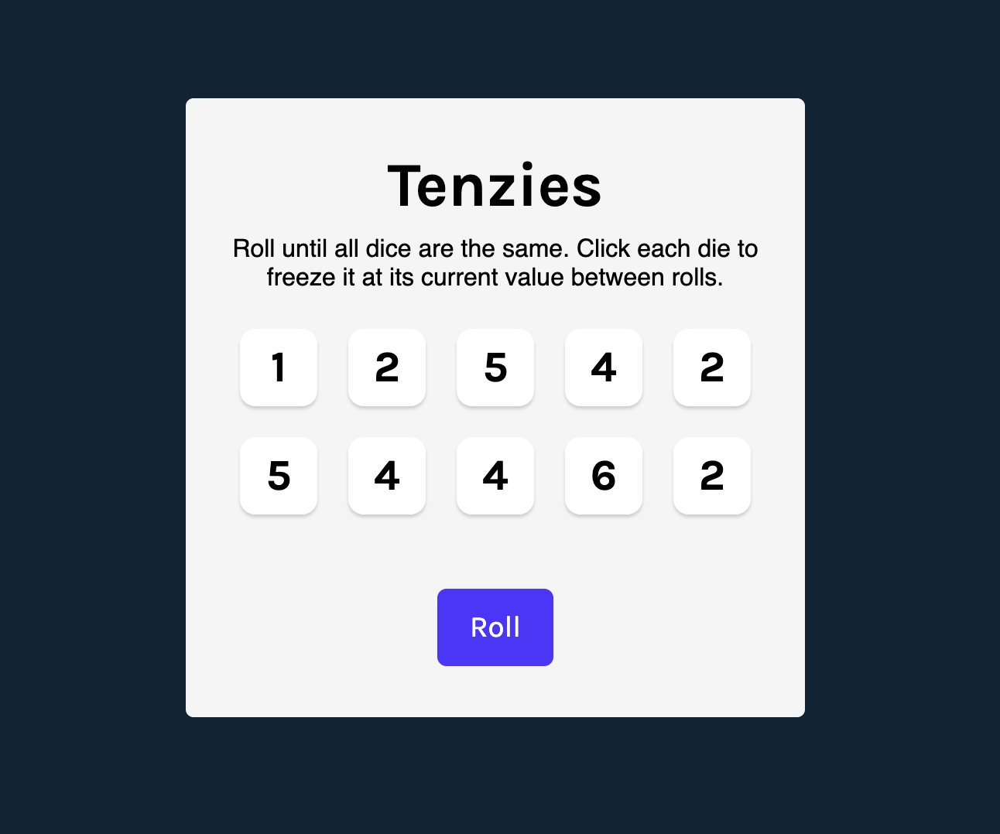

# 🎲 Tenzies Game

Tenzies est un petit jeu de hasard et de stratégie développé avec **React**. Le but du jeu est simple : **lancer les dés jusqu'à ce que tous affichent la même valeur**. À chaque tour, tu peux **geler (hold)** les dés que tu souhaites conserver pour les empêcher de changer au prochain lancer.



## 🌐 Démo en ligne

👉 Visible ici : https://tenzies-psi-nine.vercel.app/


## 🕹️ Règles du jeu

- Le jeu commence avec **10 dés** affichant des valeurs aléatoires de 1 à 6.
- Clique sur un dé pour le **geler** (le maintenir à sa valeur actuelle).
- Clique sur le bouton **"Roll"** pour relancer tous les dés non gelés.
- Le jeu est **gagné** lorsque **tous les dés sont gelés et ont la même valeur**.
- Un effet de **confettis** célèbre la victoire, et un bouton permet de recommencer une **nouvelle partie**.

---

## 🛠️ Technologies utilisées

- [React](https://reactjs.org/)
- [NanoID](https://github.com/ai/nanoid) – pour générer des identifiants uniques
- [react-confetti](https://www.npmjs.com/package/react-confetti) – pour les effets visuels de victoire
- CSS Modules ou styling personnalisé

---

## ✨ Fonctionnalités

- Interface simple et responsive
- Logique de victoire automatique
- Option pour rejouer facilement une nouvelle partie

---

## 🚀 Lancer le projet localement

### Cloner le dépôt

```bash
git clone git@github.com:Dfremont7/tenzies.git
cd tenzies
````
### Installer les dépendances
```bash
npm install
````

### Démarrer le serveur de développement
```bash
npm run dev
````
